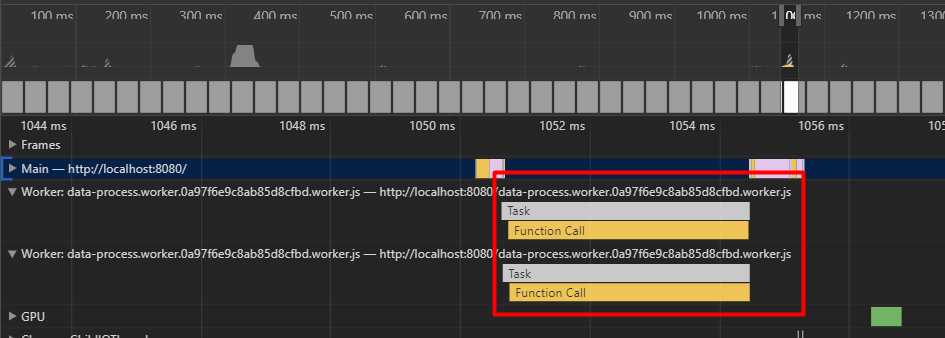

# Rxjs-ThreadPool
> A thread pool can be used with RxJS.  
> 实现一个适用于 `Rxjs` 的 `WebWorker Pool`.  
> `WebWorker Pool` 可自动分配任务给 `worker`，调度过程对用户来说是透明的。如果当前没有 `worker` 可被调度，那么任务将被缓存在任务池中，如果有 `worker` 空闲，将会调度任务池中的任务。并提供给用户 `api` 可清理任务池。
----
## API
* ThreadPool({ threadCtor, maxThreadsNumber })  
构造函数。  
`threadCtor`: `webworker` js文件，依赖于 `worker-loader` 加载
`maxThreadsNumber`: `thread pool` 最大线程数

* postMessage(data)  
向 `worker` 发送消息

* destroy()  
  销毁 `thread pool`

* clearTasks()  
  清理缓存的任务

--- 
## 示例

`worker.js`
``` javascript
function onMessage (e) {
  const data = e.data;

  self.postMessage({
    action: 'did filter',
    payload: {
      data
    }
  });
}

self.addEventListener('message', onMessage);
```

`index.js`  
``` javascript
import DataWorker from 'worker.js'

import * as Rx from 'rxjs';
import ThreadPool from './lib/index';

const pool = new ThreadPool({
  threadCtor: DataWorker,
  maxThreadsNumber: 2
});

setTimeout(() => {
  console.log('main post message');

  pool.postMessage({
    action: 'do filter',
    payload: {
      id: 1,
      data: 'hello world'
    }
  });

  pool.postMessage({
    action: 'do filter',
    payload: {
      id: 2,
      data: 'hello world'
    }
  });
}, 2000);

const workerObservable$ = Rx.fromEvent(pool, 'message');
workerObservable$.subscribe({
  next: value => {
    console.log(value.data);
  }
});
```

  

